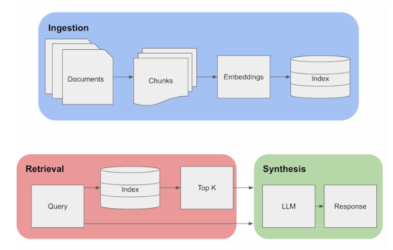
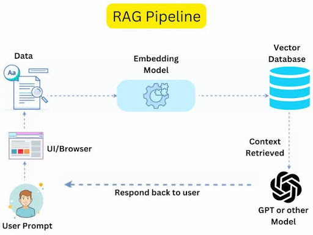

# **Retrieval Augmented Generation (RAG):**

RAG (Retrieval-Augmented Generation) is a hybrid model used in natural language processing (NLP) that combines two techniques: **retrieval** and **generation**. It’s designed to enhance the quality of answers by integrating both the accuracy of retrieving existing information (retrieval) and the flexibility of generating new text (generation).

Here’s how it works:

1. **Retrieval Phase**:
   - The model retrieves relevant information from a large corpus of documents, databases, or knowledge sources. This could be pre-existing texts, like articles or knowledge bases, which help provide context or factual information.
2. **Generation Phase**:
   - After retrieving the relevant information, a generative model like GPT (Generative Pre-trained Transformer) uses that retrieved content to generate a coherent, contextual, and enriched response. The generative model doesn't rely solely on memorized knowledge but leverages the retrieved documents to produce more accurate and up-to-date answers.

### Key Benefits of RAG:

- **Improved Accuracy**: Since it retrieves information, RAG can provide more factually correct answers, particularly for complex queries or questions about specific data.
- **Dynamic**: It can pull in the most relevant information in real-time, making it useful for up-to-date knowledge.
- **Contextual Awareness**: By combining retrieved documents with the generative power of models like GPT, it can generate responses that are both factual and contextually rich.

In short, RAG merges retrieval and generation to produce more reliable and context-aware answers, especially in tasks like question answering, chatbots, and summarization.

## How RAG work:

RAG (Retrieval-Augmented Generation) works by combining two main processes: **retrieval** and **generation**. Here's a step-by-step breakdown of how RAG operates:

### 1. **Query Input**

- The process starts when a user submits a query (a question or a request for information).

### 2. **Retrieval Phase**

- The RAG model has access to a large external corpus of documents or knowledge sources, such as databases, articles, or even the internet.
- In response to the query, the **retrieval module** (often based on models like Dense Passage Retrieval or DPR) searches through this corpus to find the most relevant documents or snippets of information.
- The retrieval step typically returns multiple candidate documents that are closely related to the query. These documents provide factual content to support the answer.

### 3. **Generation Phase**

- After retrieving the relevant documents, the **generation module** (usually a generative model like GPT) takes over.
- The generative model uses the retrieved documents along with the original query to generate a coherent and detailed response.
- Instead of simply pulling text directly from the documents, the generative model processes the information, adds context, and creates a natural-sounding, fluent response.

### 4. **Answer Output**

- The final output is a well-formed answer, combining both the retrieved factual information and the generative model's ability to generate text in a human-like manner.
- This output is designed to be both accurate (thanks to retrieval) and flexible (thanks to generation).

### Example of RAG in Action:

Let’s say a user asks, _“What is the capital of France?”_

1. **Query Input**: The question “What is the capital of France?” is submitted.
2. **Retrieval Phase**: The retrieval module scans a large corpus of documents or a database, retrieving relevant documents that mention "France" and "capital."
3. **Generation Phase**: The generative model takes the retrieved documents that contain factual information about France and generates a response, such as _"The capital of France is Paris."_

### Key Components of RAG:

- **Retrieval Model**: Finds relevant documents or information from an external source.
- **Generative Model**: Processes the retrieved documents and generates a natural language response.
- **Combination**: RAG blends these two components to provide fact-based, context-rich answers.

### Advantages of RAG:

- **Up-to-date Information**: Since RAG retrieves information in real-time from external sources, it can provide more current data than models that rely solely on pre-trained knowledge.
- **Accuracy**: It improves the factual correctness of the answer by grounding it in retrieved documents.
- **Contextualization**: The generative model helps craft responses that are more natural and contextually appropriate, instead of just copy-pasting the retrieved text.

RAG essentially enhances the reliability of answers by ensuring that they are grounded in external data, while also leveraging the powerful language generation capabilities of models like GPT.

## **Retrieval Augmented Generation Pipline**:

  
  

## **1. Ingestion: Building the Knowledge Base**

In this phase, the pipeline prepares a **searchable knowledge base** to assist the LLM in generating responses. Here’s a deeper look:

### 1.1 **Documents**

- The starting point is raw documents. These could be PDFs, articles, websites, or even user manuals.
- Challenge: Raw documents can be too large for processing directly in an LLM because of **token limitations** (e.g., GPT-4 has a token limit).
- **Why Chunking Matters:**  
  By splitting documents into smaller **chunks** (say, 500 tokens each), the system ensures that only relevant pieces are retrieved for the query.

---

### 1.2 **Embedding Creation**

- **Embedding models** convert each chunk into a **dense vector**—a list of numbers that represent the chunk's **semantic meaning**.
- Example models: OpenAI’s embeddings, SentenceTransformers (BERT variants), or Hugging Face embeddings.
- **Why embeddings?**  
  Embeddings allow **semantic search**—the ability to retrieve relevant content even if the query wording is different from the original text.

**For example:**  
 If the document contains: _"The sun rises in the east,"_  
 A query: _"Where does the sun rise?"_ can still match this content because embeddings capture the **meaning** instead of relying on exact keywords.

---

### 1.3 **Indexing Embeddings**

- Once embeddings are created, they are stored in an **index**. The index makes retrieval fast, even when you have millions of chunks.
- **Common Indexing Tools:**
  - **FAISS** (Facebook AI Similarity Search)
  - **Pinecone** (vector database as a service)
  - **Weaviate** or **Milvus**

Indexes allow quick **vector similarity searches**—usually **cosine similarity**—to compare query embeddings with chunk embeddings and find the closest matches.

---

## **2. Retrieval: Extracting Relevant Information**

In the retrieval phase, the system fetches the **most relevant chunks** from the knowledge base to assist the LLM.

### 2.1 **Query Handling**

- When a user inputs a query (e.g., _"How does the solar system work?"_), it is **embedded** into a vector.
- **Embedding the Query:**  
  This query vector is matched with **chunks stored in the index** based on their similarity score.

---

### 2.2 **Top-K Retrieval**

- **Top K** means retrieving the **K most relevant chunks** (like the top 3-5) that are closest to the query in vector space.
- This is important because the LLM should only receive **relevant chunks** to avoid overwhelming it with unnecessary information.

**Why Retrieval Matters:**  
The LLM may not have up-to-date or domain-specific knowledge. For example, if the documents contain **new medical research**, these retrieved chunks will enrich the LLM’s answer.

---

## **3. Synthesis: Generating the Final Answer**

This phase involves **combining the retrieved content with the user query** to generate a meaningful and grounded response.

### 3.1 **Feeding Data to the LLM**

- The **retrieved chunks and query** are fed into the **context window** of the LLM (e.g., GPT, LLaMA).
- The LLM can **read these chunks** as part of its prompt to generate an answer based on the combined context.

---

### 3.2 **Generating a Response**

- The LLM synthesizes a **final response** that considers both:
  1. The **query** (what the user asked)
  2. The **retrieved content** (relevant facts from the index)

This **combination of retrieval + generation** ensures the response is:

- **Factual** (grounded in the retrieved chunks)
- **Coherent** (fits with the query context)

---

### **What Happens if the Retrieved Chunks are Insufficient?**

If the **retrieved content** doesn’t cover everything the LLM needs to answer the query, the LLM will try to **"hallucinate"**—that is, fill the gaps with its own knowledge. This is why RAG pipelines are designed to **retrieve only high-quality content**.

---

## **Technical Challenges in RAG:**

1. **Chunking Trade-off:**  
   If the chunks are **too large**, relevant information might be missed. If they are **too small**, you risk retrieving irrelevant pieces.

2. **Embedding Quality:**  
   Poor embeddings can result in **irrelevant retrievals**, affecting the final response. Thus, choosing a high-quality embedding model is critical.

3. **Latency Issues:**  
   Searching through millions of vectors can be slow, but optimized databases like **FAISS** or cloud solutions like **Pinecone** make it faster.

4. **LLM Token Limits:**  
   If too many chunks are retrieved, they might exceed the LLM’s token limit (e.g., GPT-4 supports around 8,000 tokens). You need to manage this by limiting the **Top-K** results or summarizing them before feeding them into the LLM.

---

  
  

